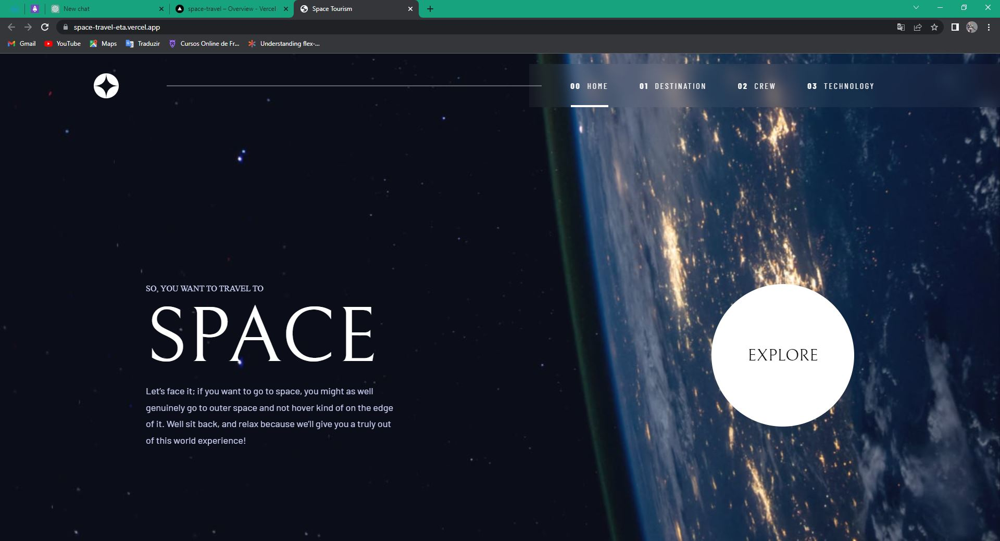
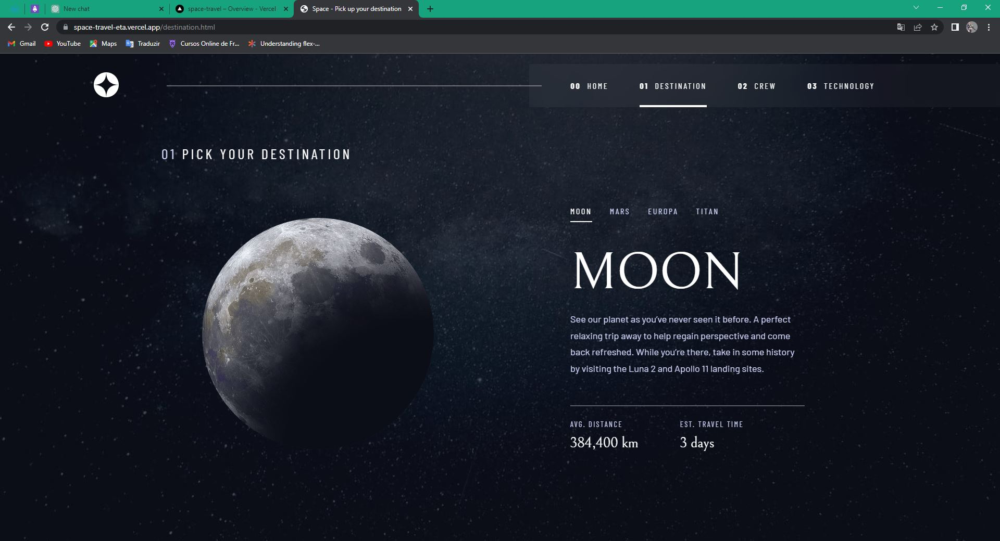
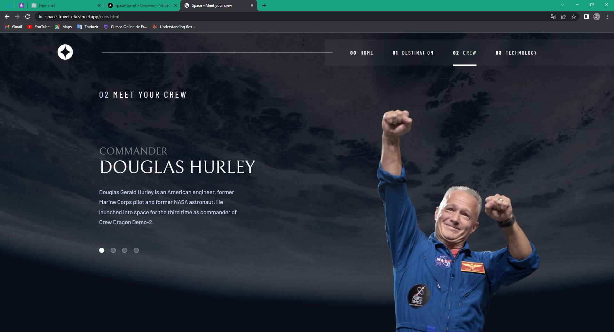
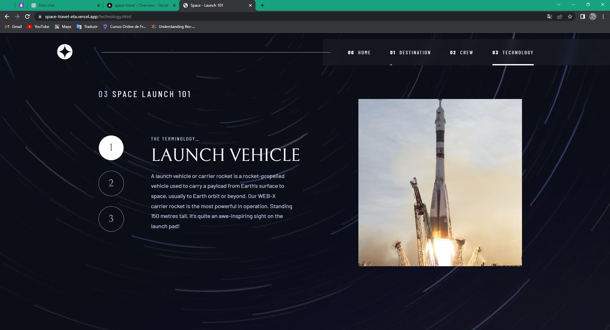
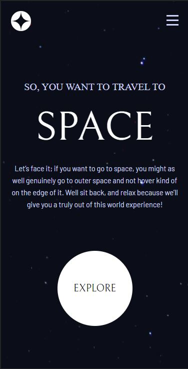
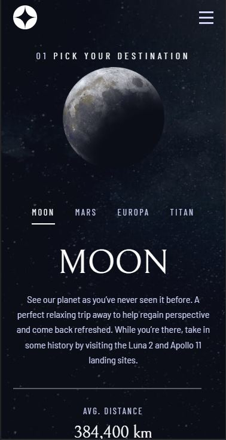
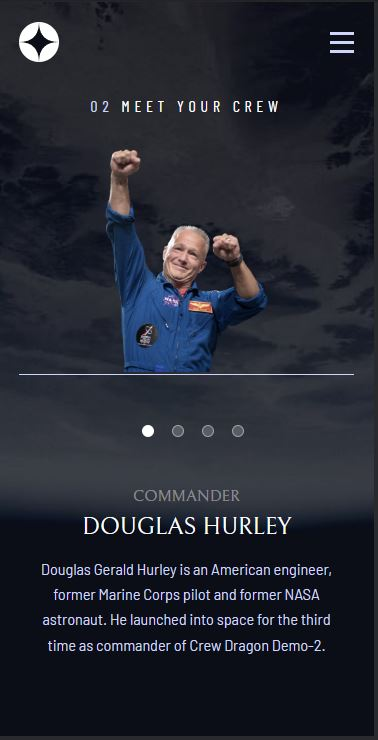
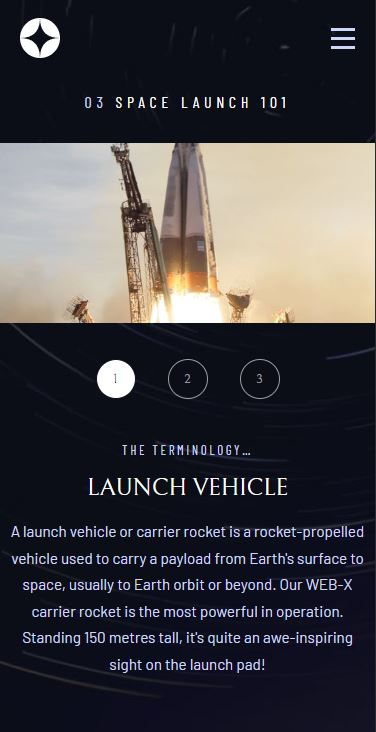

# Frontend Mentor - Space tourism website solution

Isso é uma solução para o [Space tourism website challenge on Frontend Mentor](https://www.frontendmentor.io/challenges/space-tourism-multipage-website-gRWj1URZ3). Os desafios do Front-End Mentor ajudam a desenvolvedores a melhorar suas habilidades com projetos realistas e estruturados.

## Contéudo

- [Visão Geral do projeto](#overview)
  - [Projeto](#projeto)
  - [Screenshot](#screenshot)
  - [Links](#links)
- [Meu Processo](#meu-processo)
  - [Construido com](#construido-com)
  - [O que eu aprendi](#o-que-aprendi)
  - [Planos Futuros](#planos-futuros)
- [Sobre Mim](#sobre-mim)

## Overview

### Projeto
Usuarios devem poder:

- Ver o design ideal para o dispositivo e tamanho de tela que esta usando 
- Ver o hover de todos os elementos interativos do site
- Ver cada pagina e poder alternar entre elas

### Screenshot

<style>
  .desktop img{
    width: 500px;
  }

  .desktop{
    display: flex;
    flex: 1;
    flex-wrap: wrap;
    gap: 20px;
  }

  .sub{
    font-size: 1.2rem;
    margin-top: 20px;
  }

  .mob img{
    height: 500px; 
  }
</style>

<h1 class='sub'>Versão Para Desktop</h1>
<div  class='desktop'>
  
  
  
  
</div>

<h1 class='sub'>Versão Para Dispositivos Moveis</h1>
<div  class='mob'>
  
  
  
  
</div>

### Links

- Solution URL: [https://github.com/Jonata-tr/Space-Travel](https://github.com/Jonata-tr/Space-Travel)
- Live Site URL: [https://space-travel-eta.vercel.app/index.html](https://space-travel-eta.vercel.app/index.html)

## Meu processo

### Construido com

- Semantic HTML5 markup
- CSS custom properties
- Flexbox
- CSS Grid

### O que aprendi

Aprendi como funciona a coleta de dados do javascript, álem de botar em praticas conhecimentos de grid e flex. Tambem pratiquei a reutilização de codigos css. Foi um projeto bem dificil de se fazer, e um dos meus maiores aprendizados foi na parte do JavaScrpit, esse codigo do menu mobile por exemplo foi um desafio grande, mas depois de alterar de novo e de novo, consegui chegar nessa conclusão.

```js
const mobMenu = document.querySelector(".header-menu");
const hamburguer = document.querySelector(".mob-menu");

function activeMenu() { 
  mobMenu.classList.toggle("show");
  if (mobMenu.classList.contains('show')) {
    hamburguer.src = "/assets/shared/icon-close.svg";
    return
  }
    hamburguer.src = "/assets/shared/icon-hamburger.svg";
}

document.addEventListener('click', function(event) {
  var target = event.target;
  if (!mobMenu.contains(target) && !hamburguer.contains(target)) {
    mobMenu.classList.remove('show');
    hamburguer.src = "/assets/shared/icon-hamburger.svg";
  }
});

```
### Planos Futuros

<p>
  Futuramente planejo refazer esse projeto utilizando de React, varios momentos senti que poderia utilizar de componentes e hooks. Tambem planejo a utilização de Sass para organizar melhor o meu css.
</p>

## Minhas redes

- Website - Em breve no futuro
- Front-End Mentor - [@Jonata-tr](https://www.frontendmentor.io/profile/Jonata-tr)
- Git Hub - [@JonatanTr](https://github.com/Jonata-tr)
- Linkedin - [@Jonatan Trindade](https://www.linkedin.com/in/jonata-tr/)
